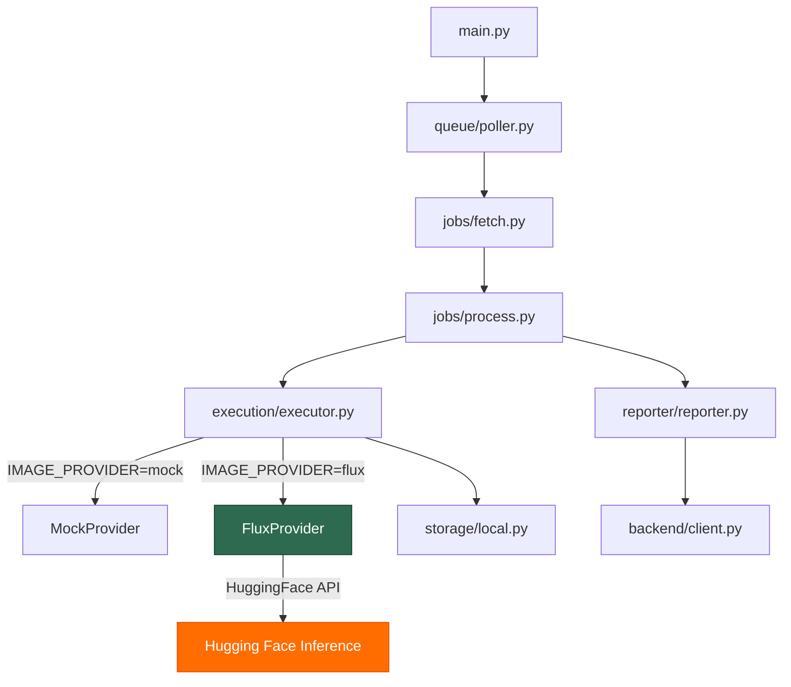

# Sprint 18 — Real FLUX Image Provider Integration

**Date:** 2026-06-30  
**Repository:** AI_STUDIO_WORKER  
**Objective:** Replace Mock Image Provider with real FLUX Image Provider

---

## Architecture Diagram

The FLUX provider slots into the existing pipeline without any structural changes:



---

## Provider Responsibility Boundary

| FluxProvider DOES | FluxProvider DOES NOT |
|---|---|
| Read configuration from settings | Save images |
| Authenticate with Hugging Face | Talk to the backend |
| Generate image via InferenceClient | Update jobs |
| Return PIL.Image.Image | Report progress |
| Classify errors into standard types | Know about storage, queue, or reporter |
| Validate HF config on init | Implement retry logic |

---

## Files Created

| File | Purpose |
|---|---|
| `worker/image_providers/flux_provider.py` | Real FLUX image provider using Hugging Face Inference API |
| `.env.example` | Documents all environment variables including HF configuration |
| `notes/Sprint_18.md` | Sprint documentation |

---

## Files Modified

| File | Change | Reason |
|---|---|---|
| `worker/config.py` | Added `hf_timeout` field | Configurable timeout for HF API calls |
| `worker/image_providers/__init__.py` | Export `FluxProvider` | Clean package-level imports |
| `worker/execution/executor.py` | Added `elif "flux"` branch + FluxProvider import | Executor resolves provider — this is its responsibility |
| `worker/main.py` | Removed MockProvider import and if/else instantiation | main.py now reads `settings.image_provider` directly. Provider resolution belongs in Executor. |
| `requirements.txt` | Added `huggingface_hub>=0.30.0` | Required for InferenceClient |

---

## Files NOT Modified

| Module | Reason |
|---|---|
| `worker/storage/` | Storage is independent of image provider |
| `worker/backend/` | Backend client unchanged |
| `worker/jobs/` | Job processing pipeline unchanged |
| `worker/reporter/` | Reporter unchanged |
| `worker/queue/` | Queue poller unchanged |
| `worker/models/` | GenerationJob already has `negative_prompt` |
| `worker/image_providers/base.py` | Interface already generic — `generate(job) → Image` |
| `worker/image_providers/mock.py` | Backwards compatible, no changes needed |

---

## Configuration

All FLUX configuration comes from `.env`:

```env
IMAGE_PROVIDER=flux
HF_TOKEN=hf_xxxxxxxxxxxxx
HF_PROVIDER=fal-ai
HF_MODEL=black-forest-labs/FLUX.1-dev
HF_TIMEOUT=120
```

Switching providers requires **only editing `.env`**:
- `IMAGE_PROVIDER=mock` → uses MockProvider (offline testing)
- `IMAGE_PROVIDER=flux` → uses FluxProvider (real AI generation)

---

## Error Handling

Errors propagate through the existing pipeline:

```
FluxProvider → Executor → Reporter → Backend
```

| Error Type | Trigger | Exception |
|---|---|---|
| Authentication | Invalid/missing HF_TOKEN | `PermissionError` |
| Timeout | HF API exceeds timeout | `TimeoutError` |
| Network | Connectivity failure | `ConnectionError` |
| Provider | Bad request, rate limit, model error | `RuntimeError` |
| Config | Missing HF_TOKEN or HF_PROVIDER | `ValueError` (at init) |

---

## Verification Results

| Test | Result |
|---|---|
| MockProvider generates image | ✅ Pass — 800×600 image |
| FluxProvider import | ✅ Pass — clean import |
| Package-level import | ✅ Pass — `from worker.image_providers import FluxProvider` |
| Executor resolves mock | ✅ Pass — `Executor().image_provider.get_name() == "mock"` |
| FluxProvider config validation | ✅ Pass — raises `ValueError` when `HF_TOKEN` missing |
| Full mock pipeline (generate → store → result) | ✅ Pass — `ExecutionResult(success=True)` |
| No regressions | ✅ Pass — all existing functionality preserved |

---

## Future Provider Compatibility

This implementation intentionally keeps image generation isolated behind `BaseImageProvider`.

Future providers such as:

- **Pony XL**
- **Illustrious**
- **NoobAI**
- **ComfyUI**
- **RunPod**
- **OpenAI**
- **Local SDXL**

can be added by:

1. Creating a new provider class implementing `BaseImageProvider`
2. Registering the provider (see below)
3. Adding configuration variables to `.env`

**Without modifying:** Executor's public API, Storage, Reporter, or Backend.

**Current implementation:** Add an `elif` branch in `Executor._resolve_image_provider()`.

**Future implementation:** Replace the conditional logic with a Provider Registry once multiple production providers exist. The `elif` approach is an interim solution, not the long-term design.

### Future: GenerationRequest

FluxProvider is designed so that it can later migrate to a `GenerationRequest` dataclass
(decoupled from `GenerationJob`) without breaking the public provider interface.
This decoupling was intentionally deferred to avoid premature abstraction.

---

## Intentionally NOT Implemented

| Feature | Reason |
|---|---|
| Google Drive storage | Out of scope — separate sprint |
| Animation / Video | Out of scope — future pipeline |
| Voice / Subtitle | Out of scope — different domain |
| Character consistency | Out of scope — requires LoRA/IP-Adapter |
| LoRA support | Out of scope — future provider enhancement |
| Reference images | Out of scope — future img2img pipeline |
| Retry logic | Deferred — providers remain stateless |
| Provider Registry | Deferred — premature with only 2 providers |
| GenerationRequest DTO | Deferred — premature abstraction |

---

## Lessons Learned

1. **Minimal main.py changes:** Provider resolution must live in Executor, not main.py. Keeping main.py as a thin startup script avoids growing conditionals.
2. **Error classification at the boundary:** Translating HF-specific exceptions into standard Python exceptions (`PermissionError`, `TimeoutError`, `ConnectionError`, `RuntimeError`) keeps the rest of the pipeline HF-agnostic.
3. **Config validation at init, not at generate:** Failing fast on missing `HF_TOKEN` at startup is better than failing mid-generation.
